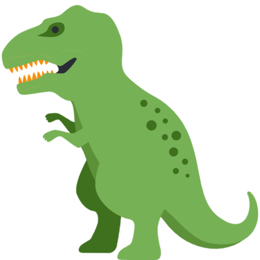

<!-- PROJECT LOGO -->
<br />
<p align="center">
  <a href="#">
    
  </a>

  <h3 align="center">Project Chat App</h3>

  <p align="center">
    Blog App using React and Express
    <br />
  </p>
</p>

<!-- TABLE OF CONTENTS -->
<details open="open">
  <summary>Table of Contents</summary>
  <ol>
    <li>
      <a href="#about-the-project">About The Project</a>
      <ul>
        <li><a href="#built-with">Built With</a></li>
      </ul>
    </li>
    <li><a href="#getting-started">Getting Started</a></li>
    <li><a href="#contact">Contact</a></li>
  </ol>
</details>

<!-- ABOUT THE PROJECT -->

## About The Project

[![blog1][product-screenshot1]](#about-the-project)

[![blog2][product-screenshot2]](#about-the-project)
[![blog3][product-screenshot3]](#about-the-project)

백엔드로 Express와 Mongodb, 프론트엔드로 React를 이용한 풀스택 웹 프로젝트입니다. 데이터베이스로 Mongodb Atlas를 이용하였고, Express를 통해서 Restful API를 구현하였습니다. User Authentication으로는 JWT를 사용했습니다. 스타일링은 styled-components을 사용했습니다. 상태 관리로 Redux를 사용했고 API요청으로 redux-saga 라이브러리를 이용했습니다. 텍스트 에디터로는 quill을 사용했습니다.

### Built With

- [React](https://reactjs.org/)
- [Redux](https://redux.js.org/)
- [styled-components](https://styled-components.com/)
- [Mongodb Atlas](https://www.mongodb.com/)
- [Express](https://expressjs.com/)
- [redux-saga](https://redux-saga.js.org/)
- [jwt](https://www.npmjs.com/package/jsonwebtoken)
- [quill](https://quilljs.com/)

## Getting Started

### Installation

1. Install server
```sh
cd backend
npm install
```

2. Install React
```sh
cd fronend
npm install
```

### Run

1. Run server and Connect to database

```sh
cd backend
npm start
```

2. Run frontend

```sh
cd fronend
npm start
```

## Contact

Lee Jongseo - [gmail](goldemshine@gmail.com) - goldemshine@gmail.com

[product-screenshot1]: images/blog2.PNG
[product-screenshot2]: images/blog4.PNG
[product-screenshot3]: images/blog6.PNG
